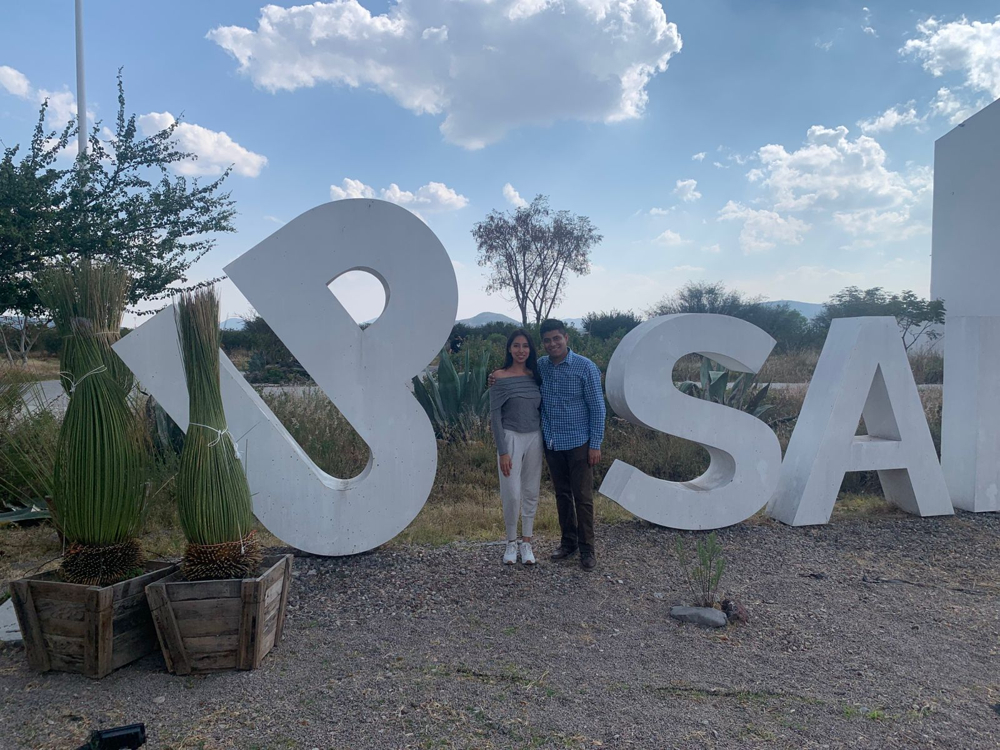

<!DOCTYPE html>
<html lang="es">
<head>
    <meta charset="UTF-8">
    <meta name="viewport" content="width=device-width, initial-scale=1.0">
    <title>Para Yasmín 💖</title>
    
</head>
<body>
    

        <h1>Para ti, Yasmín</h1>
        
        <!-- FOTO - IGUAL QUE TU EJEMPLO -->
        

            
            
❤️ Mi linda amiga ❤️

        

        
        <!-- VIDEO - IGUAL QUE TU EJEMPLO -->
        

            <iframe 
                src="https://www.youtube.com/embed/bbK0KqtuyFM" 
                title="Video para Yasmín"
                frameborder="0" 
                allow="accelerometer; autoplay; clipboard-write; encrypted-media; gyroscope; picture-in-picture" 
                allowfullscreen>
            </iframe>
        

        

            ✨ Una canción para ti ✨
        

        
        <!-- HISTORIA COMPLETA -->
        

            
Hola, hermosa Yasmín

            
            
💫 Quiero decirte algo...

            
            
Desde la primera vez que te conocí, me dio mucho gusto encontrarte en mi vida.

            
            
❤️ Me encantaría verte, ver tu carita tan linda y tus ojos tan hermosos.

            
            
🙏 Que Dios siempre te bendiga.

            
            
✨ Me gusta mucho estar contigo y acompañarte siempre, incluso hasta el universo si fuera posible.

            
            

                🤟 Me encantaría platicar contigo y enseñarte <strong>Lengua de Señas Mexicana</strong> para comunicarnos mejor.
            

            
            
💖 Gracias por todo, Yasmín.

            
            

                "Te quiero mucho
                💫 cien millones 💫
                en todos los universos"
            

        

        
        

            Con todo mi cariño
        

        

            ✨ 14 de Febrero ✨
        

        
</body>
</html>
